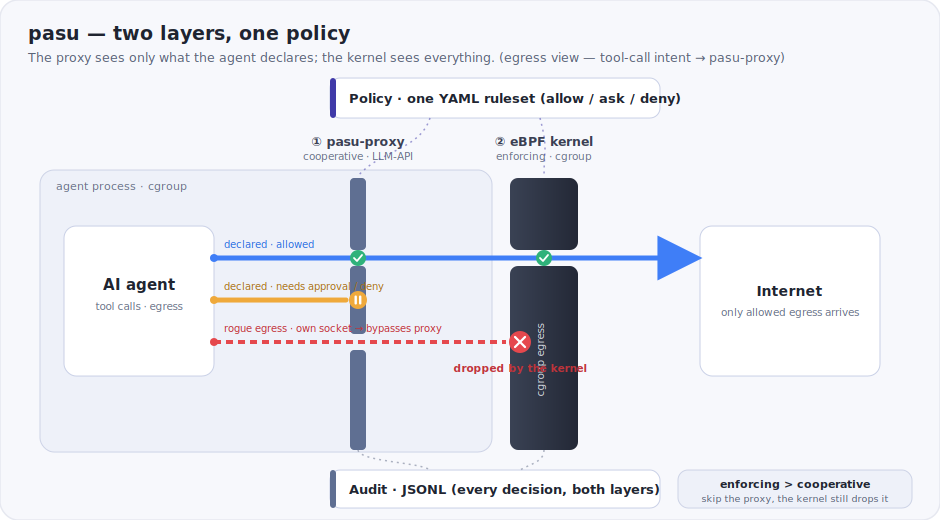
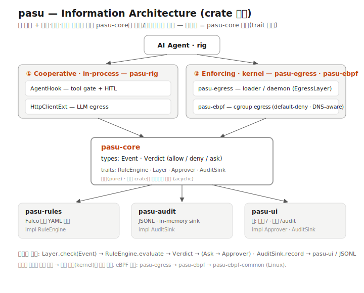

<p align="center">
  
</p>

<h1 align="center">pasu &nbsp;<sub><sup>把守</sup></sub></h1>

<p align="center">
  <b>A self-hosted security guard for AI agents — built for on-premises, air-gapped, and regulated environments.</b><br>
  Layered defense — trace → tool-call guard → kernel-enforced egress — on a single Linux host. No Kubernetes, no cloud, nothing leaves your network.
</p>

<p align="center">
  <a href="https://github.com/CharmingGroot/pasu/actions/workflows/ci.yml"></a>
  
  
  
  
  
</p>

<p align="center"><a href="README.md">한국어</a></p>

> **Control an agent's egress without trusting the agent — inside your own network.**
> An in-process hook only sees what the agent *declares*; a tool that opens its own
> socket walks right past it. pasu backs that cooperative layer with a **kernel eBPF
> guard the agent cannot bypass**, and records every decision for audit. It runs
> entirely on-host — nothing is sent to a SaaS. **enforcing > cooperative.**

---

## Why pasu

AI agents get prompt-injected, and a compromised agent will happily exfiltrate
your data. If you run agents **on-premises, air-gapped, or under compliance
requirements**, two things follow: you often *cannot* route agent traffic to a
cloud/SaaS guard, and you need **layered defense plus audit evidence** — not a
single cooperative check that a rogue tool slips past.

pasu is built for that setting: it runs entirely on one Linux host, needs **no
Kubernetes and no external service**, and applies **three layers, one policy**:

<p align="center">
  
</p>

- **① Trace / audit** (`pasu-audit`): every decision is recorded — JSONL to a
  file/SIEM, or OpenTelemetry (OTLP) spans to *your own* stack. Audit evidence
  without anything leaving your network.
- **② Tool-call guard — cooperative** (`pasu-proxy` LLM-API proxy): point the
  agent's `base_url` at the proxy; it parses the tool calls in the provider
  response, gates them, and asks for human-in-the-loop approval when needed.
  **Framework-agnostic** — any SDK, `base_url` only. Rich context; bypassable
  on its own.
- **③ Egress enforcement — kernel** (`pasu-egress` / `pasu-ebpf`): default-deny
  cgroup egress in the kernel. Language-agnostic and **unbypassable** — it
  catches whatever slips past layer ②.

Proven end-to-end: a tool that bypasses the hook with its own `reqwest` is still
**dropped by the kernel** (the eBPF kernel guard).

## On-prem & regulated fit

The uncommon part is the *combination*, on a single self-hosted box:

- **No Kubernetes, no cloud.** One Linux host; a `.deb`-free single binary path
  via `pasu run`. K8s-native network policy engines are powerful but heavy for a
  single on-prem server; SaaS agent guards can't run inside an air-gapped network.
- **Runs air-gapped.** No runtime call-home; telemetry export is opt-in and points
  at *your* collector.
- **Kernel-inline egress + agent intent + audit** together — most tools give you
  one of the three.
- **Apache-2.0**, auditable Rust, every crate behind traits.

> Honest scope: pasu is an MVP and is **not** security-certified and has no
> production references. It is a working, self-hostable reference for this niche —
> not a turnkey certified appliance.

## How pasu compares

Not a claim of global superiority — a fit for the **on-prem / regulated** axis,
where the alternatives are heavier or can't run at all.

| | **pasu** | framework / SDK guards | K8s-native policy engines | SaaS agent guards |
|---|:---:|:---:|:---:|:---:|
| Runs on a single host, **no Kubernetes** | ✅ | ✅ | ❌ (needs K8s) | ✅ |
| Runs **air-gapped** (no external service) | ✅ | ✅ | ✅ | ❌ |
| Kernel-enforced egress (unbypassable) | ✅ eBPF | ❌ cooperative | ✅ | ~ |
| Agent-intent context (tool calls, HITL) | ✅ | ✅ | ❌ | ✅ |
| Audit trail (JSONL / OTLP to your stack) | ✅ | partial | ~ | ✅ (their cloud) |
| Language / framework-agnostic | ✅ | ❌ | ✅ | ~ |

The uncommon combination for a single self-hosted host: **kernel-inline egress +
agent intent + audit** — with no Kubernetes and nothing leaving the network.

## Policy (Falco-inspired YAML)

```yaml
rules:
  - name: allow-llm
    match: { host: ".openai.com" }   # domain + subdomains
    action: allow
  - name: confirm-transfer
    match: { tool: transfer_funds }
    action: ask                      # human-in-the-loop
default: deny                        # fail-closed
```

## Quickstart

### Wrap any agent — no code changes

pasu is a **guard, not an agent**: it doesn't care what framework your agent
uses. `pasu run` puts the command in a dedicated cgroup with the kernel guard
attached before its first instruction:

```bash
sudo pasu run --policy rules.yaml -- python crew.py        # CrewAI / LangChain / anything
sudo pasu run --policy rules.yaml -- npx some-agent "task" # language-agnostic
```

Everything the policy doesn't allow is dropped by the kernel — even if the
agent (or a prompt-injected tool) opens its own sockets.

### Guard tool calls for any SDK — the LLM-API proxy

Point your agent's `base_url` at `pasu-proxy`. It forwards to the real provider,
parses the tool calls the model returns, and blocks any the policy denies
(fail-closed) before the agent runs them. The tool-call decision rides in the
provider response, so parsing the provider format covers every SDK — no
per-framework adapter:

```rust
use pasu_core::Guard;
use pasu_proxy::{router, Provider, ProxyState};
use pasu_rules::RulesetEngine;
use std::sync::Arc;

let state = Arc::new(ProxyState {
    guard: Guard::new(RulesetEngine::from_yaml(policy_yaml)?, "llm-proxy"),
    client: reqwest::Client::new(),
    upstream_base: "https://api.openai.com".into(),
    provider: Provider::OpenAi,
});
let app = router(state);   // axum Router — serve it, then point the agent's base_url at it
```

OpenAI-compatible, Anthropic, and Gemini non-streaming responses today (the
three formats cover effectively every SDK); streaming (SSE) responses pass
through unguarded for now — reassembly is next.

Deploy it as a sidecar — a slim, **unprivileged** image
([`deploy/proxy/Dockerfile`](deploy/proxy/Dockerfile)) and an agent + proxy pod
([`deploy/proxy/k8s-sidecar.yaml`](deploy/proxy/k8s-sidecar.yaml), the agent's
`base_url` → `localhost`). Runnable directly too:

```bash
pasu-proxy --policy rules.yaml --listen 127.0.0.1:8788 --upstream https://api.openai.com
```

### Deeper: kernel egress guard (Linux)

Kernel egress guard on Linux — **the same YAML**, lowered to the kernel
allowlist (a **dedicated** cgroup; never the root cgroup):

```bash
sudo pasu-daemon --policy rules.yaml --cgroup-path /sys/fs/cgroup/my-agent
# lower-level loader (flags / TOML) if you don't want the policy file:
sudo pasu-egress --cgroup-path /sys/fs/cgroup/my-agent --allow-domain api.openai.com
```

Allow rules with an IPv4 become static entries, exact hostnames are resolved
(and re-resolved), and suffix patterns (`.openai.com`) are reported — they stay
hook-layer-only until DNS-response sniffing lands. The kernel side is
default-deny, so lowering is only ever *narrower* than the policy.

Add `--admin-socket /run/pasu.sock` to inspect and edit the live guard without a
restart (this is what the UI talks to):

```bash
echo status        | socat - UNIX-CONNECT:/run/pasu.sock   # {"cgroup_path":…,"allow_ips":[…]}
echo 'allow 1.2.3.4' | socat - UNIX-CONNECT:/run/pasu.sock  # add to the kernel allowlist now
echo 'deny 1.2.3.4'  | socat - UNIX-CONNECT:/run/pasu.sock  # remove it now
```

Web UI — approvals (`/`), audit (`/audit`), and a live **egress dashboard**
(`/egress`: kernel filter coverage, add/remove allowlist entries, read-only
policy view with each rule's verdict + tool guard):

```rust
use pasu_ui::dashboard::{EgressAdmin, EgressUi};
let egress = EgressUi::new(EgressAdmin::new("/run/pasu.sock"), Some("rules.yaml".into()));
pasu_ui::serve_all(addr, approvals, feed, Some(egress)).await?;   // + /egress
```

Try it without a kernel (mock guard socket):

```bash
cargo run -p pasu-ui --example ui_demo   # http://127.0.0.1:8787/egress
```

## Run in a container

The kernel guard containerizes like any eBPF tool — `CAP_BPF` + `CAP_NET_ADMIN`
and a cgroup v2 mount. Quick proof (only `1.1.1.1` allowed; the kernel drops
everything else, whatever the app does):

```bash
docker build -f deploy/Dockerfile -t pasu-egress:latest .
./deploy/demo.sh    # allowed -> reachable · blocked -> dropped · RESULT: PASS
```

Sidecar ([`deploy/docker-compose.yml`](deploy/docker-compose.yml)) and Kubernetes
([`deploy/k8s/`](deploy/k8s)) layouts, and the cgroup-targeting rules, are in
**[docs/deployment.md](docs/deployment.md)**.

## Crates

<p align="center">
  
</p>

| crate | role |
|-------|------|
| `pasu-core` | shared types (`Event` / `Verdict`) + traits (`RuleEngine` · `Layer` · `Approver` · `AuditSink`) |
| `pasu-rules` | `RuleEngine` — Falco-inspired YAML ruleset (allow/deny/ask, default fail-closed) || `pasu-proxy` | LLM-API reverse proxy — parses tool calls from provider responses (OpenAI…) and guards them via the same `Guard`; framework-agnostic (`base_url` only) |
| `pasu-ui` | lightweight web UI — HITL approvals (`/`) + audit dashboard (`/audit`) |
| `pasu-audit` | audit sinks — JSONL (stderr / file / SIEM), in-memory, and OpenTelemetry (OTLP spans, `otel` feature) |
| `pasu-egress` · `pasu-ebpf` · `pasu-ebpf-common` | kernel eBPF cgroup egress — default-deny allowlist, DNS-aware (Linux) |
| `pasu-daemon` | composition root — lowers the policy YAML to the kernel guard (one policy, both layers) |
| `pasu-cli` | the `pasu` command — `pasu run` wraps any agent command in a guarded cgroup |

Every crate depends only on `pasu-core` (acyclic); the rule format and framework
integration are swappable behind traits.

## Dependencies

Key dependencies are pinned for reproducibility:

| dependency | version | license | why this version |
|---|---|---|---|| [aya](https://github.com/aya-rs/aya) (+ `aya-log`, `aya-build`) | git `773ca715` | MIT / Apache-2.0 | pinned until aya's next crates.io release — unpinned git deps broke our CI once (upstream API drift) |
| [Falco](https://github.com/falcosecurity/falco) | — | — | **not a dependency** — pasu borrows the *rule-format idea* only; no Falco code |

## Numbers

- **11 crates**, one acyclic core (every crate depends only on `pasu-core`)
- **Tests**: unit across the workspace + eBPF end-to-end on a real kernel (GitHub runner + Lima VM)
- **CI**: 4 jobs green — `check` (stable) · `eBPF build+unit` (nightly + bpf-linker) · `eBPF E2E` (privileged) · `cargo-deny` (advisories/licenses/sources)
- **Policy evaluation**: ~0.11–0.12 µs/decision (criterion) — effectively free next to a tool call
- **default-deny allowlist**, **DNS-aware**, **HITL**, **JSONL / OTLP audit**, **no Kubernetes**, **runs air-gapped**

## Status

MVP — the engine, policy, HITL, audit, deployment, and benchmarks are in place.

| capability | crate | state |
|---|---|:---:|
| kernel default-deny allowlist (DNS-aware) | egress/ebpf | ✅ |
| policy language (YAML) | rules | ✅ |
| LLM-API proxy — tool-call guard · HITL (any SDK) | proxy | ✅ OpenAI · Anthropic · Gemini · non-stream |
| approval + audit UI | ui | ✅ |
| audit sinks (JSONL) | audit | ✅ |
| config-driven daemon + systemd | egress + packaging | ✅ |
| **one policy file → both layers** | daemon | ✅ |

Next: proxy SSE (streaming) reassembly + Anthropic/Gemini formats and eBPF
force-routing of LLM traffic through the proxy; precise DNS-response sniffing
(toFQDN — unlocks suffix hosts in the kernel), eBPF-layer audit emission, a
control-plane API + richer UI, and a crates.io release (aya is currently
git-pinned).

## Development

```bash
cargo test              # portable crates: core, rules, ui, audit, proxy (stable)
cargo build -p pasu-egress   # eBPF stack — Linux only, nightly + bpf-linker
```

## Platform

Linux first, **self-hosted, air-gapped-friendly** — eBPF kernel enforcement is
Linux-only, on a single host, with no Kubernetes and no runtime call-home.
Telemetry export (OTLP/JSONL) is opt-in and points at your own collector.
macOS/Windows get the LLM-API proxy + UI (cooperative) for development, without
kernel enforcement.

## Contributing

Contributions welcome — see [CONTRIBUTING.md](CONTRIBUTING.md). In short:
Conventional Commits, DCO sign-off (`git commit -s`), feature branch → PR → CI green.

## Security

pasu is a security tool that runs in the kernel. Please report vulnerabilities
privately — see [SECURITY.md](SECURITY.md).

## Acknowledgements
- The policy syntax is inspired by [Falco](https://github.com/falcosecurity/falco)'s rule
  format. pasu is not affiliated with or endorsed by the Falco project or the CNCF.

## License

[Apache-2.0](LICENSE).
