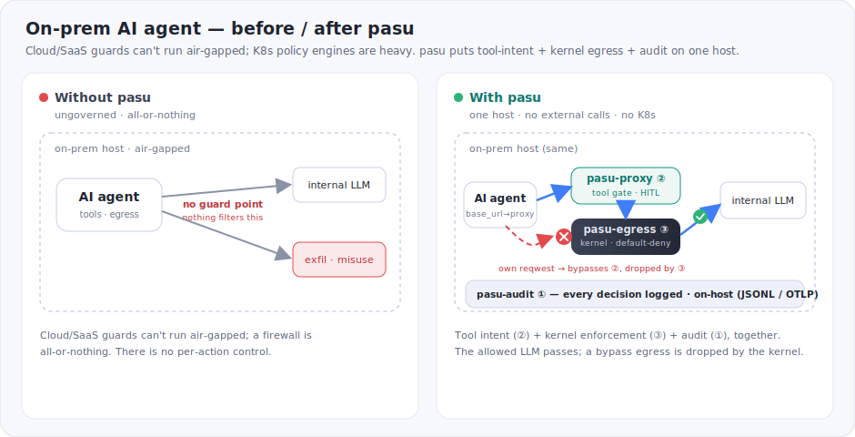

<p align="center">
  
</p>

<h1 align="center">pasu &nbsp;<sub><sup>把守</sup></sub></h1>

<p align="center">
  <b>AI 에이전트를 위한 셀프호스티드 보안 가드 — 온프렘·망분리(air-gapped)·규제 환경을 위해 만들었습니다.</b><br>
  트레이싱 → 도구 호출 가드 → 커널 강제 egress, 이 3계층을 Linux 호스트 한 대에서. 쿠버네티스도 클라우드도 없이, 네트워크 밖으로 나가는 데이터도 없이.
</p>

<p align="center">
  <a href="https://github.com/CharmingGroot/pasu/actions/workflows/ci.yml"></a>
  
  
  
  
  
</p>

<p align="center"><a href="README.en.md">English</a></p>

> **에이전트를 믿지 않고도 egress를 통제합니다.**
> 협조적 가드는 에이전트가 *선언한* 호출만 볼 수 있어서, 도구가 소켓을 직접 열면 그대로 빠져나갑니다.
> pasu는 그 아래에 **에이전트가 우회할 수 없는 커널 eBPF 가드**를 두고, 모든 판정을 감사 로그로 남깁니다.
> 전부 호스트 안에서 돌아가고, 밖으로 보내는 데이터는 없습니다. **enforcing > cooperative.**

---

## pasu가 필요한 이유

AI 에이전트는 프롬프트 인젝션(prompt injection)에 취약하고, 장악당한 에이전트는 데이터가 빠져나가는 통로가 됩니다. 온프렘·망분리·규제 환경이라면 제약이 둘 더 붙습니다 — 에이전트 트래픽을 클라우드/SaaS 가드로 내보낼 수 없고, 우회당하기 쉬운 단일 검사 대신 다층 방어와 감사 증적이 필요합니다.

pasu는 이 제약 안에서 동작하도록 만들었습니다. Linux 호스트 한 대에서 전부 돌아가고, 쿠버네티스도 외부 서비스도 필요 없으며, **정책 하나로 세 계층**을 함께 적용합니다.

<p align="center">
  
</p>

- **① 트레이싱 / 감사** (`pasu-audit`) — 모든 판정을 기록합니다. 파일·SIEM으로는 JSONL, 관측 스택으로는 OpenTelemetry(OTLP) 스팬으로. 데이터를 밖으로 내보내지 않고도 감사 증적이 남습니다.
- **② 도구 호출 가드 (협조적)** (`pasu-proxy` LLM-API 프록시) — 에이전트의 `base_url`을 프록시로 향하게 하면, provider 응답의 도구 호출을 파싱해 검사하고 필요하면 사람이 승인(HITL)합니다. **프레임워크를 가리지 않습니다** — 어떤 SDK든 `base_url`만 바꾸면 됩니다. 도구 이름과 인자까지 보는 계층이지만, 단독으로는 우회될 수 있습니다.
- **③ egress 강제 (커널)** (`pasu-egress` / `pasu-ebpf`) — 커널 cgroup egress를 기본 차단합니다. 언어를 가리지 않고 우회도 불가능해서, ②를 빠져나간 트래픽까지 여기서 최종 차단됩니다.

핵심은 이 강제 계층입니다: 도구가 ②를 우회해 자체 `reqwest`로 나가더라도 커널이 egress를 drop합니다 — 선언된 것만 보는 협조적 가드로는 못 막는 지점입니다.

## 온프렘·규제 환경 적합성

도구 호출 가드 · 커널 egress · 감사, 이 세 계층을 셀프호스티드 서버 한 대에서 함께 제공합니다.

<p align="center">
  
</p>

- **쿠버네티스도 클라우드도 필요 없습니다.** Linux 호스트 하나면 되고, `pasu run`으로 어떤 에이전트든 감쌉니다.
- **망분리 환경에서 동작합니다.** 런타임에 외부로 연결하지 않습니다. 텔레메트리 전송은 선택이고, 전송 대상도 자체 collector입니다.
- **커널 인라인 egress + 에이전트 의도 + 감사**를 한 호스트에서 함께 제공합니다.
- **Apache-2.0**, 감사 가능한 Rust로 작성했고, 모든 crate는 trait 뒤에 있어 교체할 수 있습니다.

## 한계

- **Linux 전용** — eBPF 커널 강제는 Linux에서만 동작합니다. macOS·Windows는 협조 계층(LLM-API 프록시)만 지원하며 커널 egress 강제가 없습니다.
- **커널 권한 필요** — eBPF attach에 root 또는 CAP_BPF가 필요합니다(프록시 계층은 무권한).
- **프록시 계층 단독 우회 가능** — 도구가 자체 소켓으로 직접 연결하면 프록시가 보지 못합니다. 이 경우는 커널 계층이 차단합니다.
- **L3/L4 수준 egress 제어** — IP·도메인 단위이며 TLS 페이로드나 L7 콘텐츠(DLP)는 검사하지 않습니다. 허용된 도메인으로의 유출은 allowlist로 막지 못합니다.
- **스트리밍은 버퍼링 후 전달** — SSE 응답의 도구 호출도 재조립해 검사하지만, 전체 스트림을 받아 검사한 뒤 한 번에 전달합니다(증분 릴레이 없음). DNS 인식은 best-effort입니다.
- **입력 계층 방어 아님** — 프롬프트 인젝션이나 모델 오작동은 다루지 않습니다. pasu는 egress와 도구 의도에 대한 최종 방어선입니다.
- **초기 단계(MVP)** — 보안 인증과 프로덕션 도입 사례가 없습니다.

## 정책 (Falco에서 영향받은 YAML)

```yaml
rules:
  - name: allow-llm
    match: { host: ".openai.com" }   # 도메인 + 서브도메인
    action: allow
  - name: confirm-transfer
    match: { tool: transfer_funds }
    action: ask                      # 사람 승인(HITL)
default: deny                        # fail-closed
```

## 빠른 시작

### 어떤 에이전트든 감싸기 — 코드 수정 없이

pasu는 **에이전트가 아니라 가드**입니다. 어떤 프레임워크를 쓰는지는 상관없습니다. `pasu run`은 명령을 전용 cgroup에 넣고, 그 명령이 첫 동작을 하기 전에 커널 가드를 걸어 둡니다.

```bash
sudo pasu run --policy rules.yaml -- python crew.py        # CrewAI / LangChain / 무엇이든
sudo pasu run --policy rules.yaml -- npx some-agent "task"  # 언어 무관
```

정책에 없는 건 전부 커널이 drop합니다. 에이전트나 인젝션당한 도구가 소켓을 직접 열어도 마찬가지입니다.

### 어떤 SDK든 도구 호출 가드 — LLM-API 프록시

에이전트의 `base_url`을 `pasu-proxy`로 향하게 하세요. pasu-proxy는 실제 provider로 요청을 넘기면서 모델이 돌려준 도구 호출을 파싱하고, 정책이 거부한 호출은 에이전트가 실행하기 전에 막습니다(fail-closed). 도구 호출 결정은 provider 응답에 실려 오기 때문에, provider 포맷만 파싱하면 어떤 SDK든 커버됩니다 — 프레임워크별 어댑터가 필요 없습니다.

```rust
use pasu_core::Guard;
use pasu_proxy::{router, Provider, ProxyState};
use pasu_rules::RulesetEngine;
use std::sync::Arc;

let state = Arc::new(ProxyState {
    guard: Guard::new(RulesetEngine::from_yaml(policy_yaml)?, "llm-proxy"),
    client: reqwest::Client::new(),
    upstream_base: "https://api.openai.com".into(),
    provider: Provider::OpenAi,
});
let app = router(state);   // axum Router — 서빙한 뒤 에이전트 base_url을 여기로
```

OpenAI 호환·Anthropic·Gemini를 지원합니다(세 포맷이 사실상 모든 SDK를 커버). 논스트리밍과 스트리밍(SSE) 응답 모두 검사합니다 — SSE는 delta 조각들을 재조립해 같은 정책으로 판정하며, 전체 스트림을 버퍼링한 뒤 전달합니다.

`Ask` 판정에 사람 승인을 붙이려면 바이너리를 `--ui <주소>`로 실행하세요 — 승인 대기열 웹 UI(`/`)와 결정 감사 뷰(`/audit`)가 함께 뜹니다. 미지정 시 `Ask`는 fail-closed로 거부됩니다.

사이드카로 배포할 수도 있습니다 — 슬림하고 **권한이 필요 없는** 이미지([`deploy/proxy/Dockerfile`](deploy/proxy/Dockerfile))와 에이전트+프록시를 한 파드에 담은 예시([`deploy/proxy/k8s-sidecar.yaml`](deploy/proxy/k8s-sidecar.yaml), 에이전트 `base_url` → `localhost`). 직접 실행도 됩니다:

```bash
pasu-proxy --policy rules.yaml --listen 127.0.0.1:8788 --upstream https://api.openai.com
```

### 더 깊게: 커널 egress 가드 (Linux)

Linux 커널 egress 가드 — **같은 YAML**을 커널 allowlist로 변환합니다 (전용 cgroup을 쓰고, 루트 cgroup은 절대 금지):

```bash
sudo pasu-daemon --policy rules.yaml --cgroup-path /sys/fs/cgroup/my-agent
# 정책 파일 없이 플래그/TOML로 직접 지정하려면:
sudo pasu-egress --cgroup-path /sys/fs/cgroup/my-agent --allow-domain api.openai.com
```

IPv4 allow는 정적 항목이 되고, 정확한 호스트명은 주기적으로 재해석됩니다. 접미 패턴(`.openai.com`)은 아직 커널로 내려가지 못해 리포트만 남깁니다 — DNS 응답 스니핑이 들어오면 해결됩니다. 커널은 기본 차단이라, 변환 결과는 정책보다 좁아질 뿐 넓어지지 않습니다.

`--admin-socket /run/pasu.sock`을 붙이면 재시작 없이 실행 중인 가드를 들여다보고 수정할 수 있습니다 (UI도 이 소켓을 씁니다).

```bash
echo status        | socat - UNIX-CONNECT:/run/pasu.sock   # {"cgroup_path":…,"allow_ips":[…]}
echo 'allow 1.2.3.4' | socat - UNIX-CONNECT:/run/pasu.sock  # 지금 커널 allowlist에 추가
echo 'deny 1.2.3.4'  | socat - UNIX-CONNECT:/run/pasu.sock  # 지금 제거
```

웹 UI — 승인(`/`), 감사(`/audit`), 그리고 실시간 **egress 대시보드**(`/egress`: 커널 필터 커버리지, allowlist 추가·삭제, 룰별 verdict와 도구 가드를 보여주는 읽기 전용 뷰):

```rust
use pasu_ui::dashboard::{EgressAdmin, EgressUi};
let egress = EgressUi::new(EgressAdmin::new("/run/pasu.sock"), Some("rules.yaml".into()));
pasu_ui::serve_all(addr, approvals, feed, Some(egress)).await?;   // + /egress
```

커널 없이 둘러보기 (mock 가드 소켓):

```bash
cargo run -p pasu-ui --example ui_demo   # http://127.0.0.1:8787/egress
```

## 컨테이너로 실행

커널 가드는 다른 eBPF 도구와 똑같이 컨테이너로 돌아갑니다 — `CAP_BPF` + `CAP_NET_ADMIN`과 cgroup v2 마운트만 있으면 됩니다. 빠르게 확인해 보기(`1.1.1.1`만 허용하고, 앱이 뭘 하든 나머지는 커널이 drop):

```bash
docker build -f deploy/Dockerfile -t pasu-egress:latest .
./deploy/demo.sh    # allowed -> reachable · blocked -> dropped · RESULT: PASS
```

사이드카([`deploy/docker-compose.yml`](deploy/docker-compose.yml))와 쿠버네티스([`deploy/k8s/`](deploy/k8s)) 배치, cgroup 타겟팅 규칙은 **[docs/deployment.md](docs/deployment.md)**에 정리해 두었습니다.

## 크레이트

<p align="center">
  
</p>

| crate | 역할 |
|-------|------|
| `pasu-core` | 공유 타입(`Event` / `Verdict`)과 trait(`RuleEngine` · `Layer` · `Approver` · `AuditSink`), 그리고 `Guard` 파사드 |
| `pasu-rules` | `RuleEngine` — Falco에서 영향받은 YAML 룰셋(allow/deny/ask, 기본 fail-closed) |
| `pasu-proxy` | LLM-API 리버스 프록시 — provider 응답(OpenAI…)의 도구 호출을 파싱해 같은 `Guard`로 가드; 프레임워크 무관(`base_url`만) |
| `pasu-ui` | 경량 웹 UI — HITL 승인(`/`)과 감사·egress 대시보드(`/audit`, `/egress`) |
| `pasu-audit` | 감사 sink — JSONL(stderr/파일/SIEM), 인메모리, OpenTelemetry(OTLP 스팬, `otel` feature) |
| `pasu-egress` · `pasu-ebpf` · `pasu-ebpf-common` | 커널 eBPF cgroup egress — 기본 차단 allowlist, DNS 인식 (Linux) |
| `pasu-daemon` | composition root — 정책 YAML을 커널 가드로 변환(정책 하나로 양 계층) |
| `pasu-cli` | `pasu` 명령 — `pasu run`으로 어떤 에이전트든 가드된 cgroup에 감쌈 |

모든 crate는 `pasu-core`에만 의존합니다(순환 없음). 룰 포맷과 프레임워크 통합은 trait 뒤에 있어 교체할 수 있습니다.

## 의존성

재현성을 위해 핵심 의존성의 버전을 고정해 두었습니다.

| 의존성 | 버전 | 라이선스 | 이유 |
|---|---|---|---|
| [aya](https://github.com/aya-rs/aya) (+ `aya-log`, `aya-build`) | git `773ca715` | MIT / Apache-2.0 | aya 다음 릴리스 전까지 고정 — 고정하지 않은 git 의존이 upstream API 변경으로 CI를 깨뜨린 적 있음 |
| [Falco](https://github.com/falcosecurity/falco) | — | — | **의존성이 아님** — 룰 포맷 아이디어만 빌렸을 뿐 Falco 코드는 없음 |

## 지표

- **crate 10개**, 순환 없는 코어 하나 (모든 crate가 `pasu-core`에만 의존)
- **테스트**: 워크스페이스 전반의 유닛 테스트 + 실제 커널에서의 eBPF E2E (GitHub 러너 + Lima VM)
- **CI**: 4개 잡 통과 — `check`(stable) · `eBPF build+unit`(nightly + bpf-linker) · `eBPF E2E`(privileged) · `cargo-deny`(취약점/라이선스/소스)
- **정책 평가**: ~0.11–0.12 µs/판정 (criterion) — 도구 호출 비용에 비하면 무시할 수준
- 기본 차단 allowlist, DNS 인식, HITL, JSONL / OTLP 감사, 쿠버네티스 불필요, 망분리 동작

## 상태

MVP — 엔진, 정책, HITL, 감사, 배포, 벤치마크까지 갖췄습니다.

| 기능 | crate | 상태 |
|---|---|:---:|
| 커널 기본 차단 allowlist (DNS 인식) | egress/ebpf | ✅ |
| 정책 언어 (YAML) | rules | ✅ |
| LLM-API 프록시 — 도구 호출 가드 · HITL (어떤 SDK든) | proxy | ✅ OpenAI · Anthropic · Gemini · SSE 재조립 |
| 승인 + 감사 UI | ui | ✅ |
| 감사 sink (JSONL / OTLP) | audit | ✅ |
| config 기반 daemon + systemd | egress + packaging | ✅ |
| **정책 파일 하나 → 양 계층** | daemon | ✅ |

다음 계획: SSE 증분 릴레이(현재는 전체 버퍼링), eBPF로 LLM 트래픽을 프록시로 강제 경유; 정밀 DNS 응답 스니핑(toFQDN — 커널에서 접미 호스트까지 처리), eBPF 계층 감사 emit, 컨트롤 플레인 API와 더 나은 UI, 그리고 crates.io 릴리스(현재 aya는 git 고정).

## 개발

```bash
cargo test              # 포터블 크레이트: core, rules, ui, audit, proxy (stable)
cargo build -p pasu-egress   # eBPF 스택 — Linux 전용, nightly + bpf-linker
```

## 플랫폼

Linux 우선, **셀프호스티드·망분리 친화적**입니다. eBPF 커널 강제는 Linux 전용이고, 호스트 한 대에서 쿠버네티스나 런타임 외부 연결 없이 돌아갑니다. 텔레메트리 전송(OTLP/JSONL)은 선택이고 전송 대상도 자체 collector입니다. macOS·Windows에서는 개발용으로 LLM-API 프록시와 UI(협조적 계층)만 쓸 수 있고, 커널 강제는 없습니다.

## 기여

기여 환영합니다 — [CONTRIBUTING.md](CONTRIBUTING.md)를 참고하세요. 요약하면: Conventional Commits, DCO 서명(`git commit -s`), 피처 브랜치 → PR → CI 통과.

## 보안

pasu는 커널에서 동작하는 보안 도구입니다. 취약점은 공개 이슈 대신 비공개로 제보해 주세요 — [SECURITY.md](SECURITY.md).

## 감사의 글
- 정책 문법은 [Falco](https://github.com/falcosecurity/falco)의 룰 포맷에서 아이디어를 얻었습니다. pasu는 Falco 프로젝트나 CNCF와 제휴하거나 보증받은 관계가 아닙니다.

## 라이선스

[Apache-2.0](LICENSE).
