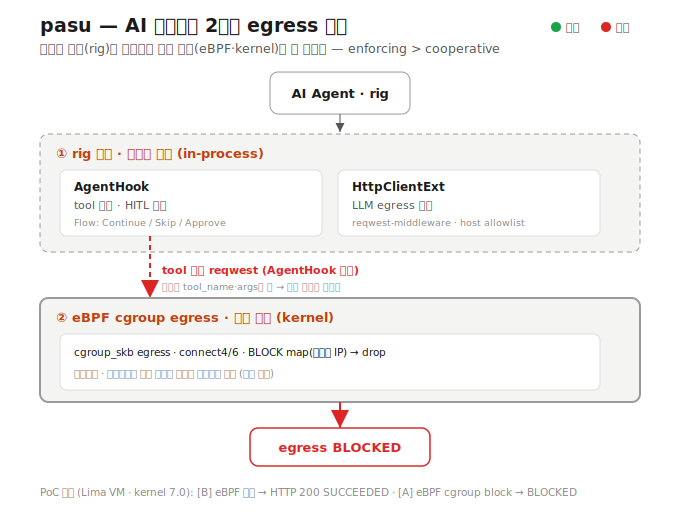

<p align="center">
  <!-- TODO(logo): drop your icon here, e.g.  -->
</p>

<h1 align="center">pasu &nbsp;<sub><sup>把守</sup></sub></h1>

<p align="center">
  <b>A security guard for AI agents — trust the policy, not the agent.</b><br>
  Kernel-enforced egress control (eBPF) + a secure-by-default <a href="https://github.com/0xPlaygrounds/rig">rig</a> integration.
</p>

<p align="center">
  <a href="https://github.com/CharmingGroot/pasu/actions/workflows/ci.yml"></a>
  
  
  
</p>

> **Control an agent's egress without trusting the agent.**
> An in-process hook only sees what the agent *declares* — a tool that opens its
> own socket walks right past it. pasu backs that cooperative layer with a
> **kernel eBPF guard the agent cannot bypass**. **enforcing > cooperative.**

---

## Why pasu

AI agents get prompt-injected, and a compromised agent will happily exfiltrate
your data. Framework-level guards are *cooperative*: they inspect declared tool
calls and egress, but a tool running its own network code slips past them.

pasu runs **two layers that share one policy**:

<p align="center">
  
</p>

- **① Cooperative — in-process (`pasu-rig`)**: tool-call gate + HITL approval, LLM egress by policy. Rich context; bypassable.
- **② Enforcing — kernel (`pasu-egress` / `pasu-ebpf`)**: cgroup egress in the kernel. Language-agnostic, **unbypassable**.

Proven end-to-end: a tool that bypasses the hook with its own `reqwest` is still
**dropped by the kernel** (the eBPF + rig combo demo).

## How pasu compares

| | **pasu** | framework wrappers | general policy engines |
|---|:---:|:---:|:---:|
| Kernel enforcing (unbypassable) | ✅ eBPF | ❌ cooperative | ~ (Falco = observe) |
| Agent-SDK integration | ✅ rig | ✅ | ❌ |
| Human-in-the-loop approval | ✅ | partial | ❌ |
| Language-agnostic protection | ✅ | ❌ | ✅ |
| Policy as code | ✅ YAML | partial | ✅ |
| Rust · ~0.12 µs/decision | ✅ | — | — |

The uncommon combination: **agent-SDK + kernel enforcing + HITL + audit, in Rust.**

## Policy (Falco-inspired YAML)

```yaml
rules:
  - name: allow-llm
    match: { host: ".openai.com" }   # domain + subdomains
    action: allow
  - name: confirm-transfer
    match: { tool: transfer_funds }
    action: ask                      # human-in-the-loop
default: deny                        # fail-closed
```

## Quickstart

Guard a rig agent (tool gate + HITL + LLM egress) with audit:

```rust
use pasu_rig::PasuSecurityHook;
use pasu_rules::RulesetEngine;

let engine = RulesetEngine::from_yaml(policy_yaml)?;
let hook = PasuSecurityHook::new(engine).with_sink(audit_sink);   // + .with_approver(ui)
agent.prompt("do the task").add_hook(hook).await?;
```

Kernel egress guard on Linux — a **dedicated** cgroup (never the root cgroup):

```bash
sudo pasu-egress --config /etc/pasu/egress.toml
# or ad hoc:
sudo pasu-egress --cgroup-path /sys/fs/cgroup/my-agent --allow-domain api.openai.com
```

Approval + audit web UI:

```rust
pasu_ui::serve(addr, approvals, feed).await?;   // "/" approvals · "/audit" decisions
```

## Crates

<p align="center">
  
</p>

| crate | role |
|-------|------|
| `pasu-core` | shared types (`Event` / `Verdict`) + traits (`RuleEngine` · `Layer` · `Approver` · `AuditSink`) |
| `pasu-rules` | `RuleEngine` — Falco-inspired YAML ruleset (allow/deny/ask, default fail-closed) |
| `pasu-rig` | rig integration — `AgentHook` (tool gate + HITL), `HttpClientExt` (LLM egress) |
| `pasu-ui` | lightweight web UI — HITL approvals (`/`) + audit dashboard (`/audit`) |
| `pasu-audit` | audit sinks — JSONL (stderr / file / SIEM) and in-memory |
| `pasu-egress` · `pasu-ebpf` · `pasu-ebpf-common` | kernel eBPF cgroup egress — default-deny allowlist, DNS-aware (Linux) |

Every crate depends only on `pasu-core` (acyclic); the rule format and framework
integration are swappable behind traits.

## Dependencies

Key dependencies are pinned for reproducibility:

| dependency | version | license | why this version |
|---|---|---|---|
| [rig](https://github.com/0xPlaygrounds/rig) (`rig-core`) | git `747b95a6` | MIT | `AgentHook` is merged upstream but not yet in a published release; moves to crates.io at rig's next release |
| [aya](https://github.com/aya-rs/aya) (+ `aya-log`, `aya-build`) | git `773ca715` | MIT / Apache-2.0 | pinned until aya's next crates.io release — unpinned git deps broke our CI once (upstream API drift) |
| [Falco](https://github.com/falcosecurity/falco) | — | — | **not a dependency** — pasu borrows the *rule-format idea* only; no Falco code |

## Numbers

- **8 crates**, one acyclic core
- **Tests**: 42 unit + eBPF end-to-end on a real kernel (GitHub runner + Lima VM)
- **CI**: 3 jobs green — `check` (stable) · `eBPF build+unit` (nightly + bpf-linker) · `eBPF E2E` (privileged)
- **Policy evaluation**: ~0.11–0.12 µs/decision (criterion) — effectively free next to a tool call
- **default-deny allowlist**, **DNS-aware**, **HITL**, **JSONL audit**

## Status

MVP — the engine, policy, HITL, audit, deployment, and benchmarks are in place.

| capability | crate | state |
|---|---|:---:|
| kernel default-deny allowlist (DNS-aware) | egress/ebpf | ✅ |
| policy language (YAML) | rules | ✅ |
| tool gate · HITL · LLM egress | rig | ✅ |
| approval + audit UI | ui | ✅ |
| audit sinks (JSONL) | audit | ✅ |
| config-driven daemon + systemd | egress + packaging | ✅ |

Next: precise DNS-response sniffing (toFQDN), eBPF-layer audit emission, a
`pasu-daemon` crate with systemd-slice orchestration, and a crates.io release
(rig is currently git-pinned).

## Development

```bash
cargo test              # portable crates: core, rig, rules, ui, audit (stable)
cargo build -p pasu-egress   # eBPF stack — Linux only, nightly + bpf-linker
```

## Platform

Linux first — eBPF kernel enforcement is Linux-only. macOS/Windows get the rig
integration + UI (cooperative), without kernel enforcement.

## Contributing

Contributions welcome — see [CONTRIBUTING.md](CONTRIBUTING.md). In short:
Conventional Commits, DCO sign-off (`git commit -s`), feature branch → PR → CI green.

## Security

pasu is a security tool that runs in the kernel. Please report vulnerabilities
privately — see [SECURITY.md](SECURITY.md).

## License

[Apache-2.0](LICENSE).
